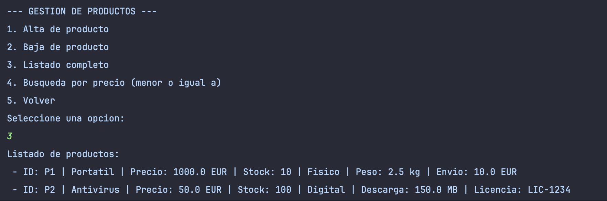
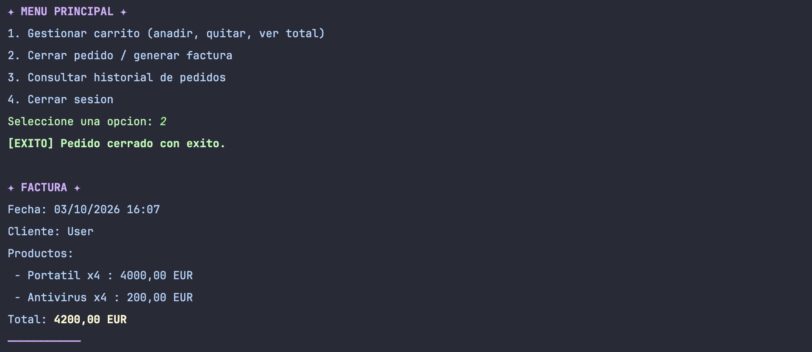
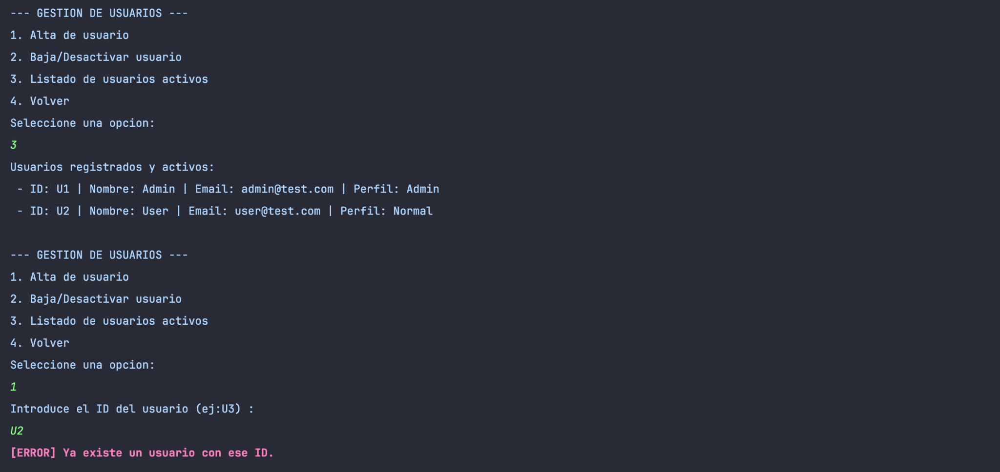
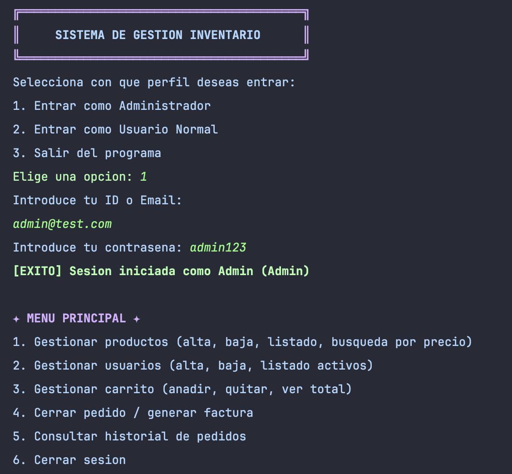
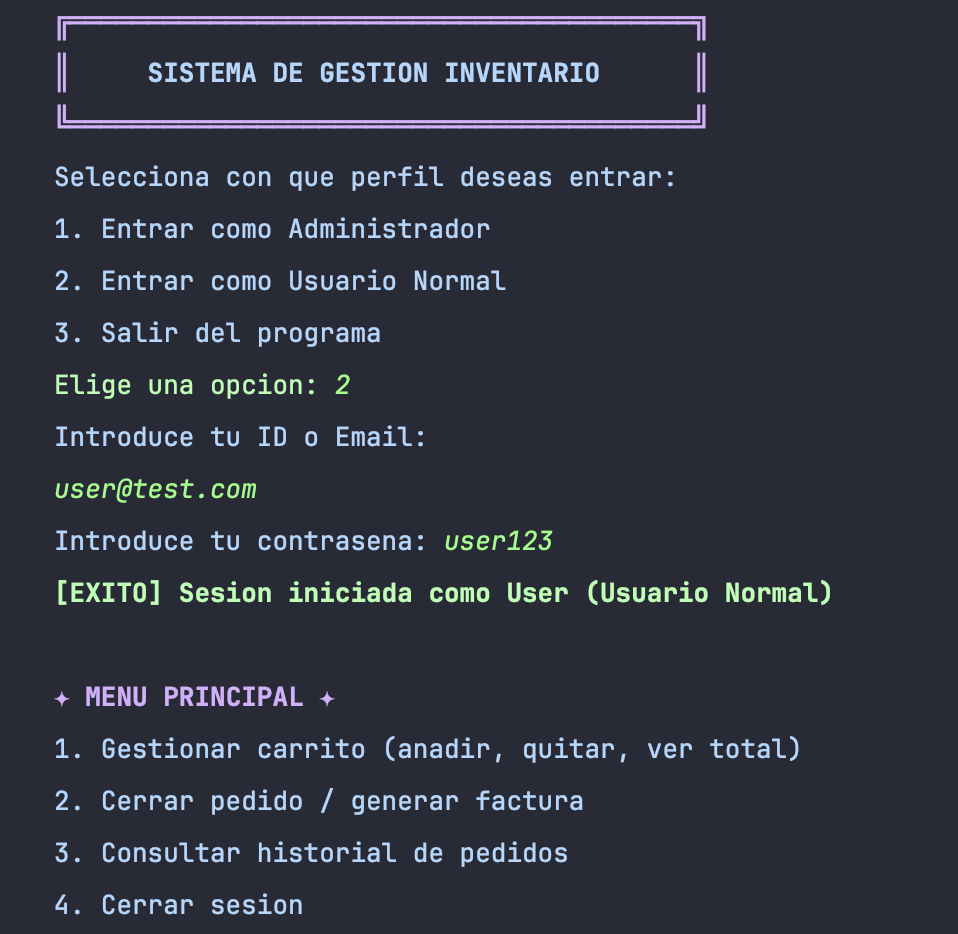
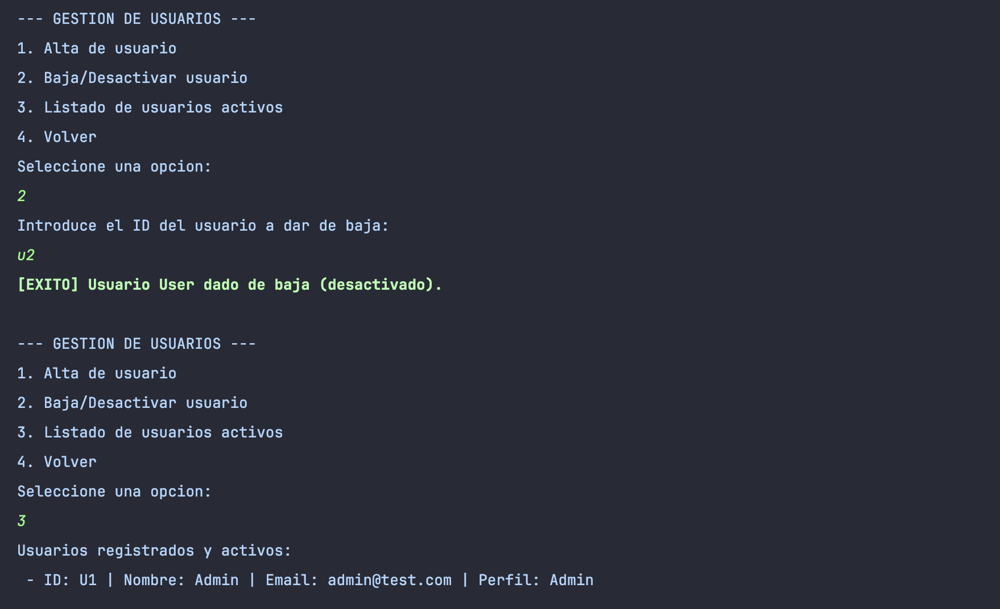
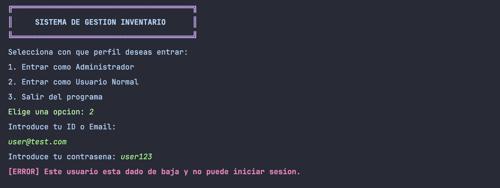

# Sistema de Gestión de Inventario

En este documento explico cómo he organizado el proyecto y por qué he tomado ciertas decisiones a la hora de organizarlo y crearlo.

## 1. El diseño del código (Arquitectura MVC)

Para organizar el proyecto, decidí no mezclar todo el código en un solo directorio gigante, sino dividirlo siguiendo el patrón MVC (Modelo - Vista - Controlador). A continuación explico paquete a paquete para que quede más claro qué hace cada cosa:

### Paquete modelo
Aquí he metido las clases que representan la información real de la tienda. Al ser de modelo, solo guardan datos y sus reglas.

* **Producto (Abstracta), ProductoFisico y ProductoDigital:** Representan lo que vendemos. He usado herencia para diferenciar un producto que tiene peso y gastos de envío, de uno que tiene tamaño de descarga y licencia. Además, le he puesto un método abstracto `getDetalles()` a la clase Producto. Gracias al polimorfismo, cada hijo lo usa a su manera: cuando listamos los productos, el programa llama al mismo método y cada uno sabe si tiene que mostrar su peso o su licencia.

*Ejemplo de polimorfismo con productos físicos y digitales*

* **Usuario (Abstracta), UsuarioAdmin y UsuarioNormal:** Sirven para guardar quién entra a la tienda y los permisos que tiene.
* **Carrito:** Utiliza un `HashMap` para relacionar cada producto que quieres comprar con la cantidad exacta que quieres llevarte.
* **Pedido:** Es la factura final. Cuando haces un pedido, el programa hace como una copia del carrito para que el historial no se rompa si mañana un admin decide borrar ese producto de la tienda.

*Ejemplo de factura final*

### Paquete vista
Es la cara visible de la aplicación. Se encarga única y exclusivamente de imprimir cosas bonitas por la pantalla.

* **VistaConsola:** Contiene todos los `System.out.println` del programa (textos, facturas, menús, preguntas al usuario).
* **Estilos:** Contiene las variables ANSI (Pastel, Bold, etc.) para que la interfaz se vea llamativa, ya que al ser un programa ejecutado en terminal, siempre ayuda que ciertas cosas se diferencien con algún color.

### Paquete controlador
* **Controlador:** Es el que manda por así decirlo. Recoge lo que el usuario escribe por teclado (`Scanner`), toma las decisiones (como verificar si hay stock o si tienes permisos) y conecta el Modelo con la Vista.

### Paquete principal
* **Main:** Es un archivo súper corto que solo sirve para darle al “Play” y arrancar el controlador.

---

## 2. Decisiones de diseño (Uso de Colecciones)

Como no usamos bases de datos reales, toda la info se queda en la memoria de Java mientras el programa está encendido, utilizando diferentes “Colecciones” según lo que necesitaba:

* **HashMap (Mapas):** Lo he usado para el catálogo de productos y la lista de usuarios, guardando cada uno con su ID como “llave”. Lo elegí porque en un mapa no puedes meter dos llaves iguales, así me aseguro de que no haya IDs repetidos (que es lo que pide el enunciado). Además, me viene genial para buscar usuarios súper rápido por su ID en vez de tener que ir mirando la lista uno a uno. Por si acaso, también compruebo que no se repita el email, porque se puede iniciar sesión con él.

*Ejemplo de crear un usuario cuyo ID ya existe.*

* **ArrayList (Listas):** Lo he usado para el Historial de Pedidos, porque ahí solo necesito ir apilando las facturas una detrás de otra según se van comprando.

---

## 3. El “Extra” Elegido: Sistema de Roles mediante Herencia

Creé una clase padre llamada `Usuario` y dos clases hijas que heredan de ella: `UsuarioNormal` y `UsuarioAdmin`. Gracias a esto, el menú es dinámico:

* Si inicias sesión como **Usuario Normal**, el menú principal se adapta a ti (te muestra 4 opciones y te oculta todo el panel de administración).
* Si inicias sesión como **Administrador**, el menú te muestra las 6 opciones completas.

*Ejemplo de menús de cada tipo de usuario*

Para que no hagan trampas, si un usuario normal teclea un 5 o un 6 (las opciones ocultas de admin), el sistema le suelta “Opción no válida”. También he puesto cuidado en que si el admin da de baja a alguien, ese usuario ya no pueda volver a entrar, y que un admin no se pueda autoborrar por error.

*Ejemplo de dar de baja a un usuario e intentar iniciar sesión con él*

---

## 4. Manejo de Errores (Excepciones y Anti-Crashes)

He medido el tema de los errores para que el programa no se rompa y lance pantallas rojas de Java.

* **Excepciones de Teclado:** Todo está envuelto en bloques `try-catch`. Si el programa te pide un número (por ejemplo, para indicar la cantidad de stock) y tú tecleas una letra, el programa te avisa amablemente y te vuelve a preguntar en vez de petar.

*Ejemplo de teclear al azar en el menú y cómo responde el try-catch*

* **Excepciones de Negocio:** He hecho que salten excepciones de Java (`IllegalArgumentException`) pero con mensajes míos personalizados cuando alguien intenta hacer cosas que no tienen sentido. Por ejemplo: intentar meter en el carrito más cosas de las que hay en stock, o crear productos con precio negativo. El controlador pilla el fallo y te avisa en rojo, pero el programa sigue funcionando.

*Ejemplo de intentar añadir al carrito más productos del stock que realmente hay*
